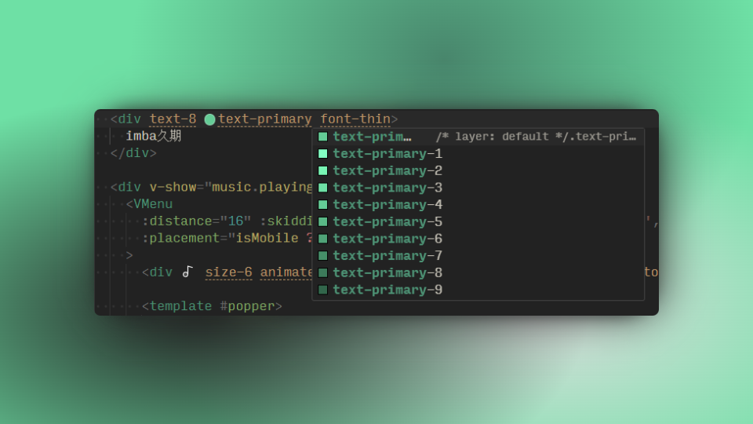

<h1 align="center">uno-colors 🎨</h1>

<p align="center">Generate UnoCSS color gradation</p>

## Usage

Install the package

```bash
pnpm add uno-colors -D
```

Configure `uno.config.ts`

```ts
import { unoColors } from 'uno-colors'
import { defineConfig } from 'unocss'

export default defineConfig({
  theme: {
    colors: unoColors({
      primary: '#64cc96'
    })
  }
})
```

## Preview


